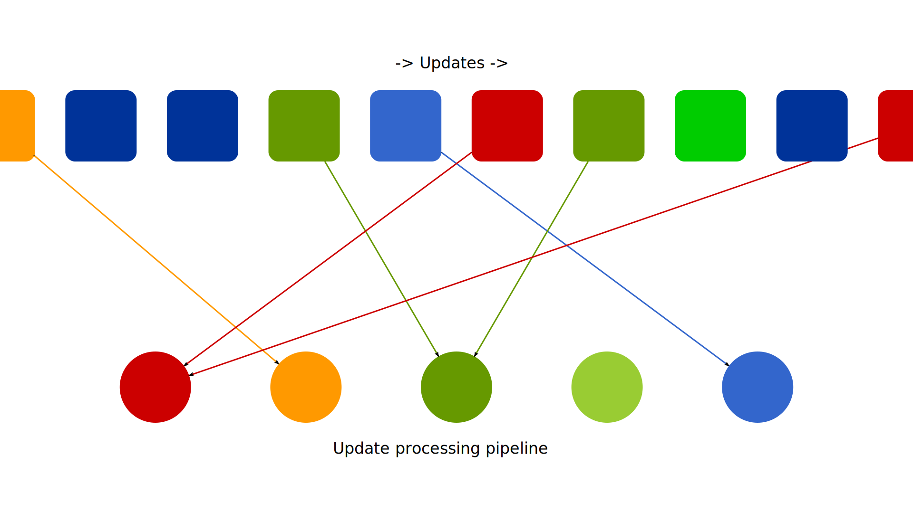

= Core

The core of the bot is a https://en.wikipedia.org/wiki/Chain-of-responsibility_pattern[chain-of-responsibility pattern].
There are only two classes here:

- link:src/main/kotlin/by/jprof/telegram/bot/core/UpdateProcessor.kt[`UpdateProcessor`], a stand-alone… https://tgbotapi.inmo.dev/docs/dev.inmo.tgbotapi.types.update.abstracts/-update/index.html[`Update`] processor.
All user-facing features are implemented via them.
Update processor should only process the updates it knows about and filter out everything else.
- link:src/main/kotlin/by/jprof/telegram/bot/core/UpdateProcessingPipeline.kt[`UpdateProcessingPipeline`], a set of registered update processors + dispatching logic.
All the incoming updates (the bot listens for every message in a chat) are passed to the pipeline.
The pipeline dispatches the updates asynchronously to the registered update processors and handles timeouts and exceptions from them.

