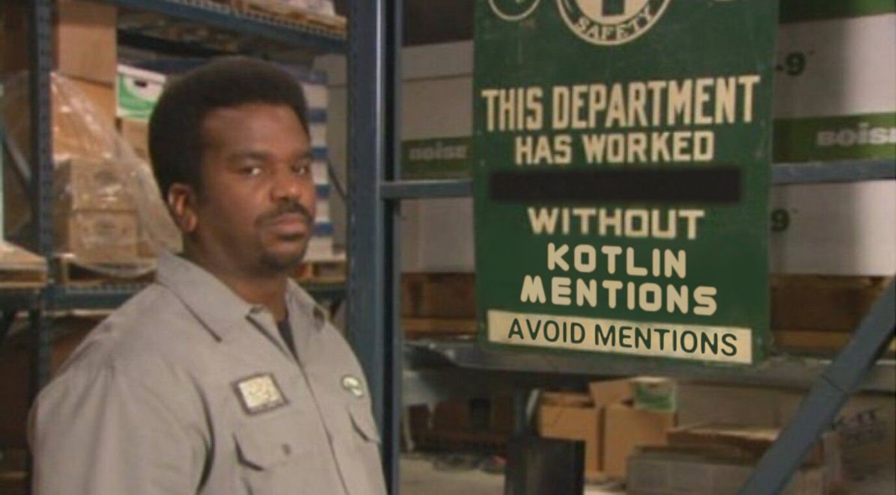

= Kotlin

This features responds with meme when Kotlin is mentioned:

The image is drawn dynamically with https://github.com/JetBrains/skija[Skija] library and true time since last Kotlin mention (except of a cooldown) is drawn inside the black charcoal area.
