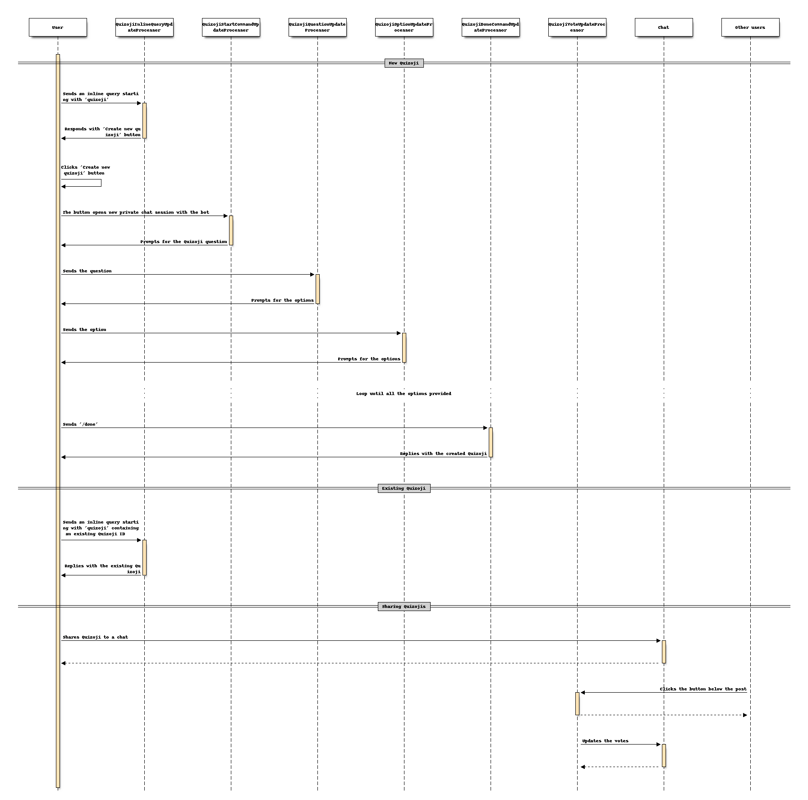

= Quizoji

This feature allows users to create _quizojis_.
Quizojis are quezes + emojis.
This feature works very similar to the https://t.me/like[@like] Telegram bot.

The way it works is best described by this sequence diagram:

Yes, it's complex and link:../dialogs[stateful].
